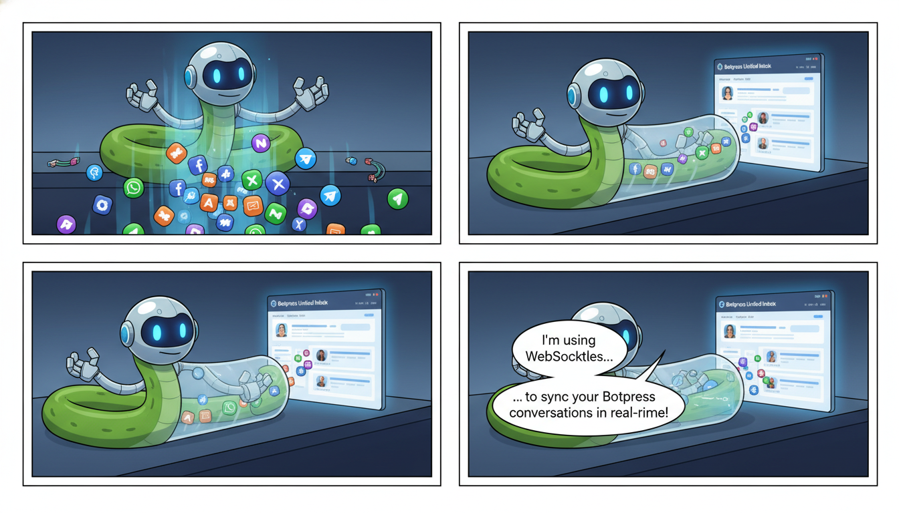

This is a professional and comprehensive `README.md` for your repository.

---

# Botpress SocketIO Backend (Python)

[](https://www.python.org/)
[](https://flask.palletsprojects.com/)
[](https://flask-socketio.readthedocs.io/)

A robust Python-based middleware that bridges [Botpress Cloud](https://botpress.com/) and client-side applications. This service utilizes WebSockets (Flask-SocketIO) to fetch, aggregate, and organize bot conversations and messages in real-time, providing a structured data format for custom dashboards or chat interfaces.

## 🚀 Features

-   **Real-time Communication**: Bi-directional communication via SocketIO for low-latency data fetching.
-   **Multi-Integration Support**: Automatically iterates through all integrations (Webchat, WhatsApp, Telegram, etc.) associated with your Botpress bot.
-   **Hierarchical Data Structuring**: Groups messages by integration ID and further categorizes them by unique Conversation IDs.
-   **Botpress Cloud Integration**: Seamlessly communicates with the Botpress v1 Admin and Chat APIs.
-   **Error Handling**: Built-in mechanisms to catch API failures and emit descriptive error messages to the client.

## 🛠️ Tech Stack

-   **Language**: Python 3.x
-   **Framework**: Flask
-   **WebSocket**: Flask-SocketIO
-   **HTTP Client**: Requests
-   **API**: Botpress Cloud API (v1)

## 📋 Prerequisites

Before running the server, ensure you have:
1.  A **Botpress Cloud Account**.
2.  A **Personal Access Token** (Bearer Token) from your Botpress settings.
3.  Your **Bot ID** and **Workspace ID**.

## 🔧 Installation

1.  **Clone the repository:**
    ```bash
    git clone https://github.com/your-username/botpress-socketio-backend-py.git
    cd botpress-socketio-backend-py
    ```

2.  **Create a virtual environment (optional but recommended):**
    ```bash
    python -m venv venv
    source venv/bin/activate  # On Windows: venv\Scripts\activate
    ```

3.  **Install dependencies:**
    ```bash
    pip install -r requirements.txt
    ```

## 🚀 Running the Server

Start the Flask-SocketIO server with:

```bash
python main.py
```
By default, the server will run on `http://localhost:5000`.

## 📖 Usage Guide

### SocketIO Events

#### 1. Client Emits: `get_conversations`
To fetch data, the client must emit a `get_conversations` event with the following JSON payload:

| Key | Type | Description |
| :--- | :--- | :--- |
| `botid` | String | Your Botpress Bot ID |
| `workspace_id` | String | Your Botpress Workspace ID |
| `bearer` | String | Botpress Personal Access Token (e.g., "Bearer bp_...") |

**Example (JavaScript Client):**
```javascript
const socket = io("http://localhost:5000");

socket.emit("get_conversations", {
    botid: "your-bot-id",
    workspace_id: "your-workspace-id",
    bearer: "Bearer your-token"
});
```

#### 2. Server Emits: `bot_conversations_data`
The server processes the request and returns a structured object containing all conversations grouped by integration.

**Sample Response Structure:**
```json
{
  "integration_id_123": {
    "conversation_abc": [
      { "id": "msg_1", "payload": { "text": "Hello!" }, "direction": "incoming" },
      { "id": "msg_2", "payload": { "text": "How can I help?" }, "direction": "outgoing" }
    ]
  }
}
```

#### 3. Error Handling: `error`
If an API call fails or authentication is invalid, the server emits an `error` event:
```javascript
socket.on("error", (data) => {
    console.error("Server Error:", data.message);
});
```

## 📁 Repository Structure

```text
├── main.py              # Application entry point & SocketIO logic
├── requirements.txt     # Python dependencies
└── README.md            # Documentation
```

## 🔐 Security Considerations

-   **CORS**: Currently configured to `*` (allow all). For production, update `cors_allowed_origins` in `main.py` to your specific domain.
-   **Tokens**: Never hardcode your `bearer` tokens. This API expects them to be passed from the client, but ideally, they should be stored in environment variables if the backend is acting as a proxy for a single bot.

## 🤝 Contributing

1.  Fork the Project
2.  Create your Feature Branch (`git checkout -b feature/AmazingFeature`)
3.  Commit your Changes (`git commit -m 'Add some AmazingFeature'`)
4.  Push to the Branch (`git push origin feature/AmazingFeature`)
5.  Open a Pull Request

## 📄 License

Distributed under the MIT License. See `LICENSE` for more information.

---
*Developed for seamless Botpress integrations.*